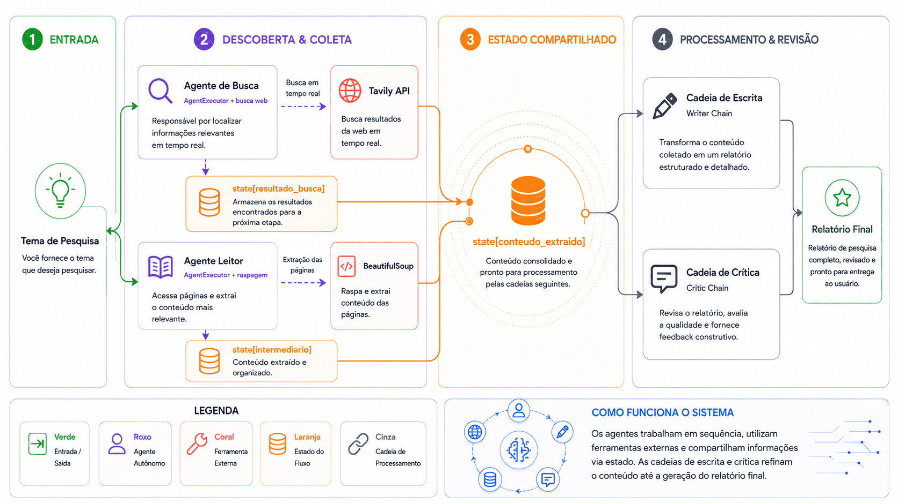
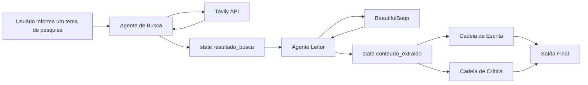

# Sistema Multiagente de Pesquisa com LangChain


Este projeto representa um **Assistente de Pesquisa Multiagente** construído com LangChain.  


A ideia principal é dividir uma tarefa complexa de pesquisa em várias etapas especializadas, onde cada agente ou cadeia tem uma responsabilidade clara dentro do fluxo.

Em vez de uma única IA receber um tema e tentar responder sozinha, o sistema organiza o trabalho como uma pequena equipe de pesquisa:

1. Um agente busca fontes na internet.
2. Outro agente acessa e lê o conteúdo das páginas.
3. Uma cadeia de escrita organiza o material em um relatório.
4. Uma cadeia de crítica revisa a qualidade da resposta.
5. O sistema entrega uma saída final mais estruturada e confiável.

---

## Objetivo do Projeto

O objetivo é criar um fluxo automatizado capaz de receber um **tema de pesquisa** e gerar um **relatório final revisado**, utilizando agentes, ferramentas externas e memória compartilhada.

Exemplo de entrada:

```text
Quais são as principais tendências de IA generativa no atendimento ao cliente?
```

Exemplo de saída esperada:

```text
Relatório estruturado com contexto, principais descobertas, análise, conclusão e possíveis fontes utilizadas.
```

---

## Visão Geral da Arquitetura

O fluxo é composto por agentes, ferramentas externas, estados intermediários e cadeias de processamento.



---

## Como o Fluxo Funciona

O processo começa quando o usuário fornece um tema de pesquisa. Esse tema é enviado para o **Agente de Busca**, responsável por procurar informações relevantes na internet em tempo real.

O Agente de Busca utiliza uma ferramenta externa, como a **Tavily API**, para encontrar fontes atualizadas, links, resumos e trechos relacionados ao tema pesquisado. Depois da busca, os resultados são salvos no estado do workflow, em uma estrutura como:

```python
state["resultado_busca"]
```

Esse estado funciona como uma memória temporária. Ele permite que as próximas etapas acessem os dados que já foram produzidos anteriormente.

Depois disso, entra o **Agente Leitor**. Ele recebe os resultados da busca, acessa as URLs encontradas e extrai o conteúdo das páginas. Para isso, utiliza uma ferramenta de raspagem de dados, como o **BeautifulSoup**.

O conteúdo extraído é salvo em:

```python
state["conteudo_extraido"]
```

Esse conteúdo passa a ser a matéria-prima para a etapa de escrita.

A **Cadeia de Escrita** recebe o material extraído e transforma os dados brutos em um relatório organizado. Ela estrutura o conteúdo com introdução, contexto, análise, principais pontos e conclusão.

Em seguida, a **Cadeia de Crítica** revisa o relatório produzido. Ela verifica se o texto está claro, completo, coerente e alinhado ao tema inicial. Também pode sugerir melhorias, apontar falhas e avaliar a qualidade geral da resposta.

Por fim, o sistema gera a **Saída Final**, que é o relatório revisado e pronto para ser entregue ao usuário.

---

## Componentes do Sistema

### 1. Tema de Pesquisa

É a entrada inicial do sistema.

Exemplo:

```text
Impacto dos agentes de IA no atendimento ao cliente
```

Esse tema inicia todo o fluxo de execução.

---

### 2. Agente de Busca

O **Agente de Busca** tem a responsabilidade de procurar fontes relevantes na internet.

Ele pode buscar:

- Artigos recentes;
- Notícias;
- Documentações;
- Relatórios técnicos;
- Publicações institucionais;
- Conteúdos especializados.

Ele não escreve o relatório final. Sua função é encontrar boas fontes para alimentar o restante do processo.

---

### 3. Tavily API

A **Tavily API** é usada como ferramenta externa de busca na web.

Ela retorna informações como:

- Título da página;
- URL;
- Resumo;
- Trechos relevantes;
- Fonte do conteúdo.

Os resultados retornam para o Agente de Busca e são armazenados no estado do fluxo.

---

### 4. State: resultado_busca

O `state["resultado_busca"]` armazena os resultados encontrados na internet.

Exemplo conceitual:

```python
state["resultado_busca"] = [
    {
        "titulo": "Relatório sobre IA generativa",
        "url": "https://exemplo.com/relatorio",
        "resumo": "Texto resumido sobre o tema..."
    }
]
```

Esse conteúdo será usado pelo Agente Leitor.

---

### 5. Agente Leitor

O **Agente Leitor** recebe os links encontrados e acessa as páginas para extrair o conteúdo principal.

Ele atua como uma pessoa que recebe uma lista de fontes e começa a ler cada uma delas para separar as informações realmente relevantes.

---

### 6. BeautifulSoup

O **BeautifulSoup** é uma biblioteca Python utilizada para extrair conteúdo de páginas HTML.

Ele ajuda a remover ruídos como:

- Menus;
- Rodapés;
- Scripts;
- Propagandas;
- Elementos visuais desnecessários.

E mantém informações úteis como:

- Títulos;
- Parágrafos;
- Listas;
- Textos principais;
- Links relevantes.

---

### 7. State: conteudo_extraido

O `state["conteudo_extraido"]` armazena o conteúdo real extraído das páginas.

Exemplo conceitual:

```python
state["conteudo_extraido"] = [
    {
        "url": "https://exemplo.com/relatorio",
        "conteudo": "Texto extraído da página..."
    }
]
```

Esse conteúdo será usado pelas cadeias de escrita e crítica.

---

### 8. Cadeia de Escrita

A **Cadeia de Escrita** transforma o conteúdo bruto em um relatório bem estruturado.

Ela pode organizar a resposta em seções como:

- Introdução;
- Contexto;
- Principais descobertas;
- Análise;
- Riscos;
- Oportunidades;
- Conclusão.

---

### 9. Cadeia de Crítica

A **Cadeia de Crítica** revisa o relatório gerado.

Ela avalia pontos como:

- Clareza;
- Completude;
- Coerência;
- Qualidade da argumentação;
- Aderência ao tema;
- Possíveis lacunas;
- Necessidade de melhoria.

Essa etapa funciona como um revisor sênior avaliando o trabalho antes da entrega.

---

### 10. Saída Final

A **Saída Final** é o resultado entregue ao usuário.

Ela pode conter:

- Relatório completo;
- Resumo executivo;
- Análise técnica;
- Recomendações;
- Pontos de atenção;
- Fontes utilizadas.

---

## Papel do State

O `state` é uma das partes mais importantes do fluxo.

Ele funciona como uma memória compartilhada entre as etapas. Cada agente ou cadeia lê informações do estado, processa algo e grava novos dados para a próxima etapa.

Exemplo simplificado:

```python
state = {
    "tema": "IA generativa no atendimento ao cliente",
    "resultado_busca": [],
    "conteudo_extraido": [],
    "relatorio": "",
    "avaliacao": "",
    "saida_final": ""
}
```

Sem o `state`, cada etapa ficaria isolada.  
Com o `state`, o sistema funciona como uma equipe coordenada.

---

## Estrutura Sugerida do Projeto

```text
multi-agent-research-assistant/
│
├── README.md
├── .env.example
├── requirements.txt
│
├── src/
│   ├── main.py
│   ├── agents/
│   │   ├── search_agent.py
│   │   └── reader_agent.py
│   │
│   ├── tools/
│   │   ├── tavily_tool.py
│   │   └── scrape_tool.py
│   │
│   ├── chains/
│   │   ├── writer_chain.py
│   │   └── critic_chain.py
│   │
│   └── state/
│       └── workflow_state.py
│
└── docs/
    └── architecture.png
```

---

## Variáveis de Ambiente

Exemplo de arquivo `.env`:

```env
OPENAI_API_KEY=sua_chave_openai
TAVILY_API_KEY=sua_chave_tavily
```

---

## Instalação

Crie um ambiente virtual:

```bash
python -m venv .venv
```

Ative o ambiente:

```bash
source .venv/bin/activate
```

No Windows:

```bash
.venv\Scripts\activate
```

Instale as dependências:

```bash
pip install -r requirements.txt
```

---

## Dependências Sugeridas

Exemplo de `requirements.txt`:

```txt
langchain
langchain-openai
langchain-community
tavily-python
beautifulsoup4
requests
python-dotenv
```

---

## Exemplo Conceitual de Execução

```python
from src.agents.search_agent import run_search_agent
from src.agents.reader_agent import run_reader_agent
from src.chains.writer_chain import run_writer_chain
from src.chains.critic_chain import run_critic_chain

state = {
    "tema": "Tendências de IA generativa no atendimento ao cliente",
    "resultado_busca": None,
    "conteudo_extraido": None,
    "relatorio": None,
    "avaliacao": None,
    "saida_final": None
}

state["resultado_busca"] = run_search_agent(state["tema"])
state["conteudo_extraido"] = run_reader_agent(state["resultado_busca"])
state["relatorio"] = run_writer_chain(state["tema"], state["conteudo_extraido"])
state["avaliacao"] = run_critic_chain(state["tema"], state["relatorio"], state["conteudo_extraido"])

state["saida_final"] = {
    "relatorio": state["relatorio"],
    "avaliacao": state["avaliacao"]
}

print(state["saida_final"])
```

---

## Benefícios da Arquitetura

Essa abordagem traz algumas vantagens importantes:

- Separa responsabilidades entre agentes;
- Facilita manutenção e evolução do sistema;
- Permite adicionar novas ferramentas no futuro;
- Melhora a organização do fluxo;
- Reduz a dependência de uma única resposta do LLM;
- Permite revisão e validação antes da entrega final;
- Facilita observabilidade e rastreamento das etapas.

---

## Possíveis Melhorias Futuras

Algumas evoluções possíveis para o projeto:

- Adicionar ranking de fontes;
- Criar validação de confiabilidade das URLs;
- Implementar citações no relatório final;
- Adicionar banco vetorial para memória de longo prazo;
- Usar LangGraph para orquestração do fluxo;
- Adicionar logs e métricas de execução;
- Criar interface com Streamlit ou FastAPI;
- Adicionar avaliação automática de qualidade da resposta.

---

## Resumo

Este sistema multiagente funciona como uma equipe de pesquisa automatizada.

O usuário fornece um tema, o Agente de Busca encontra fontes, o Agente Leitor extrai o conteúdo, a Cadeia de Escrita cria o relatório, a Cadeia de Crítica revisa a qualidade e o sistema entrega uma resposta final estruturada.

A principal força da arquitetura está na divisão clara de responsabilidades e no uso do `state` como memória compartilhada entre as etapas.


## Licença

O código-fonte deste projeto está licenciado sob a **Apache License 2.0**.

Os materiais didáticos, textos, explicações, imagens, diagramas e conteúdos relacionados ao curso de Desenvolvimento de Agentes ministrado no MBA IBMEC são disponibilizados apenas para fins educacionais, demonstração e portfólio.

Não é permitida a cópia, redistribuição, modificação, venda ou uso comercial desses materiais didáticos sem autorização prévia do autor.

Consulte o arquivo [LICENSE](./LICENSE) para mais detalhes sobre a licença aplicada ao código-fonte.