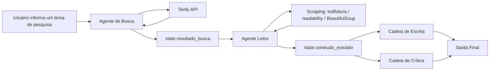

# Sistema Multiagente de Pesquisa com LangChain

Este projeto é um **Assistente de Pesquisa Multiagente** construído com LangChain, desenvolvido como estudo prático no curso de Desenvolvimento de Agentes (MBA IBMEC).


A ideia central é dividir uma tarefa complexa de pesquisa em etapas especializadas, onde cada agente ou cadeia tem uma responsabilidade clara dentro do fluxo, em vez de uma única chamada de LLM tentar resolver tudo de uma vez:

1. Um agente busca fontes na internet.
2. Outro agente acessa e lê o conteúdo das páginas encontradas.
3. Uma cadeia de escrita organiza o material em um relatório.
4. Uma cadeia de crítica revisa a qualidade da resposta.
5. O sistema entrega uma saída final estruturada.

> **Status:** projeto em desenvolvimento. As ferramentas de busca e leitura já funcionam de forma independente; a orquestração completa do fluxo (agentes + chains + state compartilhado) ainda está sendo construída. Veja a seção [Estado Atual da Implementação](#estado-atual-da-implementação).

---

## Objetivo do Projeto

Criar um fluxo automatizado capaz de receber um **tema de pesquisa** e gerar um **relatório final revisado**, utilizando agentes, ferramentas externas e memória compartilhada (`state`).

Exemplo de entrada:

```text
Quais são as principais tendências de IA generativa no atendimento ao cliente?
```

Exemplo de saída esperada:

```text
Relatório estruturado com introdução, principais descobertas, conclusão e fontes utilizadas.
```

---

## Arquitetura Pretendida

O fluxo é pensado em torno de agentes, ferramentas externas, estados intermediários e cadeias de processamento.



Documentação complementar (uso interno, não versionada — ver `.gitignore`):

- `docs/como-funciona.md` — explicação passo a passo do fluxo.
- `docs/explicacao-diagrama.md` — leitura didática do diagrama.
- `src/tools/explicacao_tools.md` — explicação linha a linha das tools de busca e scraping.

---

## Estado Atual da Implementação

| Componente | Status | Onde está |
|---|---|---|
| Tool de busca web (`consulta_web` via Tavily) | ✅ Implementado | `src/tools/tools.py` |
| Tool de scraping (`scrapping_url`, com fallback trafilatura → readability → BeautifulSoup) | ✅ Implementado | `src/tools/tools.py` |
| Tool de scraping simples (`scrape_url`, versão anterior/mais enxuta) | ✅ Implementado | `src/tools/tools.py` |
| Agente de busca (`agente_pesquisa`) | ✅ Definido | `src/agents/agents.py` |
| Agente leitor (`agente_leitura`) | ✅ Definido | `src/agents/agents.py` |
| Cadeia de escrita (`gerar_relatorio_de_pesquisa`) | ✅ Implementada | `src/agents/agents.py` |
| Cadeia de crítica (`critic_prompt`) | ⚠️ Esqueleto criado, prompt ainda vazio | `src/agents/agents.py` |
| `state` compartilhado entre etapas | ❌ Ainda não implementado | — |
| Pipeline/orquestração do fluxo completo | ❌ Ainda não implementado | `src/pipelines/pipeline.py` (vazio) |
| Ponto de entrada (`main.py`) | ⚠️ Hoje só testa as tools isoladamente, não executa o fluxo completo | `main.py` |

A seção [Papel do State](#papel-do-state) e o exemplo de execução abaixo descrevem o **fluxo alvo**, ainda não conectado ponta a ponta.

---

## Componentes do Sistema (visão conceitual)

### 1. Tema de Pesquisa

Entrada inicial do sistema.

```text
Impacto dos agentes de IA no atendimento ao cliente
```

### 2. Agente de Busca

Responsável por procurar fontes relevantes na internet (artigos, notícias, documentações, relatórios técnicos). Não escreve o relatório final — apenas encontra boas fontes para alimentar o restante do processo.

### 3. Tavily API

Ferramenta externa de busca na web, usada pela tool `consulta_web`. Retorna título, URL e um trecho resumido de cada resultado (limitado aos 5 primeiros resultados e 500 caracteres por trecho).

### 4. State: `resultado_busca`

Armazena os resultados encontrados na internet, para uso posterior pelo Agente Leitor.

### 5. Agente Leitor

Recebe os links encontrados e acessa as páginas para extrair o conteúdo principal, usando a tool de scraping.

### 6. Scraping (trafilatura / readability / BeautifulSoup)

A tool `scrapping_url` tenta três estratégias em sequência até conseguir um conteúdo útil (mínimo de 200 caracteres):

1. **trafilatura** — melhor para artigos e blogs.
2. **readability** — extrai o "corpo" principal da página.
3. **BeautifulSoup** — fallback bruto, removendo tags como `script`, `style`, `nav`, `footer`, `header`, `aside`, `form`, `noscript`, `iframe`, `svg`.

Também trata erros comuns (403, 404, 429, timeout, conexão) com mensagens controladas em vez de lançar exceção, para não quebrar a execução do agente.

### 7. State: `conteudo_extraido`

Armazena o conteúdo real extraído das páginas, matéria-prima da etapa de escrita.

### 8. Cadeia de Escrita

Transforma o conteúdo bruto em um relatório estruturado com introdução, principais descobertas, conclusão e fontes.

### 9. Cadeia de Crítica

Revisa o relatório gerado (clareza, completude, coerência, aderência ao tema). **Ainda não implementada** — o prompt está vazio em `src/agents/agents.py`.

### 10. Saída Final

Resultado entregue ao usuário: relatório + avaliação da crítica.

---

## Papel do State

O `state` é pensado como memória compartilhada entre as etapas do fluxo:

```python
state = {
    "tema": "IA generativa no atendimento ao cliente",
    "resultado_busca": [],
    "conteudo_extraido": [],
    "relatorio": "",
    "avaliacao": "",
    "saida_final": "",
}
```

Sem o `state`, cada etapa ficaria isolada. Essa estrutura ainda não existe no código — hoje cada tool/agente é chamado de forma independente (ver `main.py`).

---

## Estrutura Real do Projeto

```text
02/
├── README.md
├── LICENSE.md
├── pyproject.toml
├── uv.lock
├── .python-version
├── .env                 # não versionado
│
├── main.py              # ponto de entrada atual (testa as tools isoladamente)
│
├── images/
│   └── diagrama.png
│
├── docs/                # não versionado (.gitignore)
│   ├── como-funciona.md
│   ├── explicacao-diagrama.md
│   └── diagrama.png
│
└── src/
    ├── agents/
    │   └── agents.py    # agente_pesquisa, agente_leitura, writer chain, critic chain (WIP)
    ├── tools/
    │   ├── tools.py             # consulta_web, scrape_url, scrapping_url
    │   └── explicacao_tools.md  # não versionado (.gitignore)
    └── pipelines/
        └── pipeline.py  # vazio — orquestração ainda não implementada
```

---

## Variáveis de Ambiente

Arquivo `.env` na raiz do projeto:

```env
TAVILY_API_KEY=sua_chave_tavily
OPENAI_API_KEY=sua_chave_openai
GOOGLE_API_KEY=sua_chave_google
LANGSMITH_API_KEY=sua_chave_langsmith
WEATHERSTACK_API_KEY=sua_chave_weatherstack
```

- `TAVILY_API_KEY` e `OPENAI_API_KEY` são usadas hoje pelas tools e agentes.
- `GOOGLE_API_KEY`, `LANGSMITH_API_KEY` e `WEATHERSTACK_API_KEY` estão reservadas para uso futuro (modelo alternativo via `langchain-google-genai`, observabilidade via LangSmith e uma possível tool de clima), mas ainda não são lidas pelo código.

> **Atenção:** em `src/tools/tools.py`, o `TavilyClient` é inicializado lendo `os.getenv("TAVILI_API_KEY")` (sem o "Y"), enquanto o `.env` define `TAVILY_API_KEY`. Ajuste o nome da variável (em um dos dois lados) antes de rodar a busca, ou a chave não será carregada.

---

## Instalação

Este projeto usa [`uv`](https://docs.astral.sh/uv/) para gerenciar o ambiente e as dependências (`pyproject.toml` + `uv.lock`).

Instale as dependências e crie o ambiente virtual automaticamente:

```bash
uv sync
```

Rode o script de exemplo:

```bash
uv run main.py
```

Alternativamente, com `pip`:

```bash
python -m venv .venv
source .venv/bin/activate   # Windows: .venv\Scripts\activate
pip install -e .
```

---

## Dependências Principais

Definidas em `pyproject.toml` (Python >= 3.11):

```txt
beautifulsoup4
langchain
langchain-community
langchain-core
langchain-google-genai
langchain-openai
lxml
python-dotenv
readability-lxml
requests
rich
streamlit
tavily-python
trafilatura
```

---

## Exemplo de Uso Atual

Hoje, `main.py` testa as tools de forma isolada (sem orquestração de agentes):

```python
from src.tools.tools import consulta_web

resultado = consulta_web.invoke(
    "What is the latest research on using AI for climate change mitigation?"
)
print(resultado)
```

---

## Exemplo Conceitual do Fluxo Completo (alvo, ainda não implementado)

```python
from src.agents.agents import agente_pesquisa, agente_leitura, gerar_relatorio_de_pesquisa

state = {
    "tema": "Tendências de IA generativa no atendimento ao cliente",
    "resultado_busca": None,
    "conteudo_extraido": None,
    "relatorio": None,
    "avaliacao": None,
    "saida_final": None,
}

# state["resultado_busca"] = agente_pesquisa().invoke(...)
# state["conteudo_extraido"] = agente_leitura().invoke(...)
state["relatorio"] = gerar_relatorio_de_pesquisa.invoke(
    {"topic": state["tema"], "research": state["conteudo_extraido"]}
)
# state["avaliacao"] = critic_chain.invoke(...)  # ainda não implementada

state["saida_final"] = {
    "relatorio": state["relatorio"],
    "avaliacao": state["avaliacao"],
}

print(state["saida_final"])
```

---

## Próximos Passos

- [ ] Corrigir o nome da variável de ambiente da Tavily (`TAVILI_API_KEY` → `TAVILY_API_KEY`) em `src/tools/tools.py`.
- [ ] Corrigir o nome do modelo em `src/agents/agents.py` (`gpt-4o-minit` → `gpt-4o-mini`).
- [ ] Implementar o prompt e a chain de crítica (`critic_prompt`).
- [ ] Implementar o `state` compartilhado e a orquestração em `src/pipelines/pipeline.py`.
- [ ] Conectar o fluxo completo em `main.py` (busca → leitura → escrita → crítica → saída final).
- [ ] Avaliar uso de LangGraph para orquestração do fluxo.
- [ ] Adicionar interface com Streamlit (dependência já presente em `pyproject.toml`).
- [ ] Adicionar citações e ranking de fontes no relatório final.

---

## Benefícios da Arquitetura

- Separa responsabilidades entre agentes;
- Facilita manutenção e evolução do sistema;
- Permite adicionar novas ferramentas no futuro;
- Reduz a dependência de uma única resposta do LLM;
- Permite revisão e validação antes da entrega final;
- Facilita observabilidade e rastreamento das etapas.

---

## Resumo

Este sistema multiagente funciona como uma equipe de pesquisa automatizada: o usuário fornece um tema, o Agente de Busca encontra fontes, o Agente Leitor extrai o conteúdo, a Cadeia de Escrita cria o relatório e a Cadeia de Crítica revisa a qualidade antes da entrega final.

As tools de busca e leitura já estão implementadas e funcionais; a conexão entre agentes, chains e o `state` compartilhado é o próximo passo do projeto.

---

## Licença

O código-fonte deste projeto está licenciado sob a **Apache License 2.0**.

Os materiais didáticos, textos, explicações, imagens, diagramas e conteúdos relacionados ao curso de Desenvolvimento de Agentes ministrado no MBA IBMEC são disponibilizados apenas para fins educacionais, demonstração e portfólio.

Não é permitida a cópia, redistribuição, modificação, venda ou uso comercial desses materiais didáticos sem autorização prévia do autor.

Consulte o arquivo [LICENSE.md](./LICENSE.md) para mais detalhes sobre a licença aplicada ao código-fonte.
